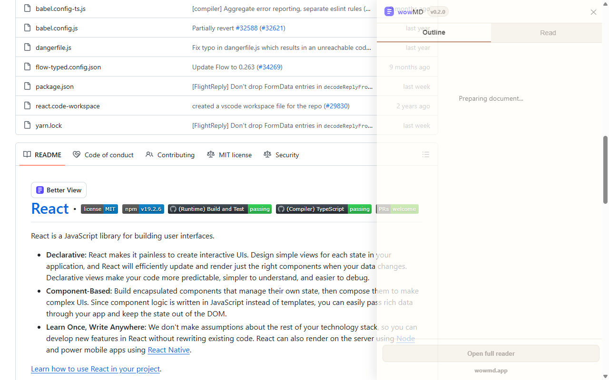
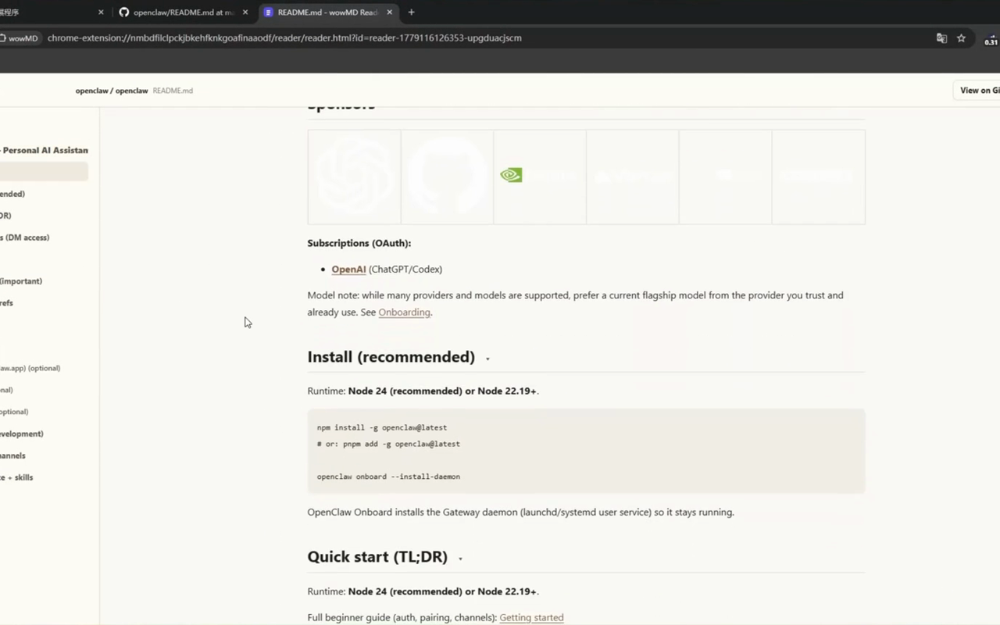
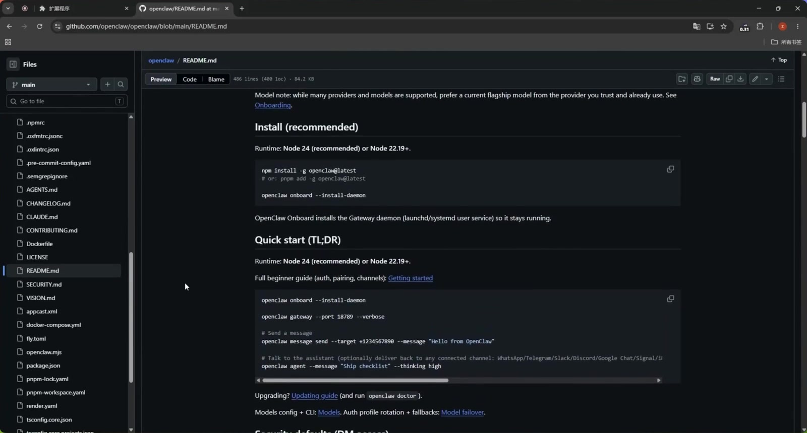

# wowMD 中文说明

[English README](README.md)

wowMD 是一个轻量级 Chrome 扩展，用来把较长的公开 GitHub README 和 Markdown 文件变成更清晰、更容易导航的结构化阅读体验。

## 它做什么

wowMD 专注于一个常见场景：阅读 GitHub 上较长、结构复杂的 README 或 `.md` / `.markdown` 文档。

当当前页面足够复杂、确实值得使用结构化阅读时，wowMD 会在文档区域显示 `Better View` 按钮。点击后，页面右侧会打开一个阅读面板，提供目录、章节跳转和阅读视图。如果用户想进行更长时间的沉浸式阅读，可以点击 `Open full reader`，在浏览器新标签页中打开扩展内部的全屏阅读器。

## 效果预览





[](docs/media/hero-demo.mp4)

这些预览图片和视频仅用于展示 wowMD 效果，属于品牌识别资产，不授权复用。

## 安装

### Chrome Web Store

Chrome Web Store 版本目前正在审核中。商店提交素材不包含在这个公开仓库中。

### 本地加载

在 Chrome Web Store 审核通过前，请通过本地加载方式安装：

1. 下载或克隆这个仓库。
2. 打开 Chrome，进入 `chrome://extensions/`。
3. 开启 Developer mode。
4. 点击 Load unpacked。
5. 选择 `extension/` 目录。
6. 打开公开 GitHub README 或 `.md` 页面进行测试。

## 核心特点

- **只在合适时出现**：短 README 不显示入口，避免打扰。
- **默认显示目录**：打开面板后优先展示 Outline，而不是直接复制全文。
- **目录跳转阅读**：点击目录项后自动切换到 Read，并滚动到对应标题。
- **清晰返回路径**：Read 顶部提供 `Back to outline`。
- **右侧辅助面板**：GitHub 原页面仍然是主场景，wowMD 只是阅读辅助。
- **全屏阅读器**：点击 `Open full reader` 后，在新标签页中打开本地结构化阅读器。
- **H2 独立折叠**：长文档可以按章节收起和展开。
- **代码块高亮**：尽可能保留代码可读性。
- **表格横向滚动**：宽表格不会撑破阅读布局。
- **图片路径修复**：自动处理 README 中常见的相对图片路径。
- **安全渲染**：Markdown 渲染后的 HTML 会经过清洗，避免危险脚本执行。
- **友好错误提示**：不把 403、404、TypeError 或 stack trace 直接展示给用户。

## 当前功能范围

wowMD v0.x 是阅读辅助工具，不是完整文档平台。

当前支持：

- 公开 GitHub 仓库首页 README。
- 公开 GitHub `.md` 文件页。
- 公开 GitHub `.markdown` 文件页。
- 右侧阅读面板。
- 扩展内部新标签页全屏阅读器。
- 文档目录、阅读视图、H2 折叠、代码块、表格和图片路径修复。

当前不支持：

- 私有仓库。
- 非 GitHub 网站。
- GitHub Issue、Pull Request、Wiki 等页面。
- 非 Markdown 文件。
- AI 总结、翻译、编辑、收藏、云同步、账号系统或设置页。

未来增值功能可以通过 `wowmd.app` API 提供，但当前全屏阅读器仍然只做本地结构化阅读，不上传文档内容。

## 使用方式

1. 打开一个公开 GitHub 仓库首页或 Markdown 文件页，例如：
   - `https://github.com/facebook/react`
   - `https://github.com/owner/repo/blob/main/README.md`
2. 如果文档足够复杂，页面内容区域会出现 `Better View`。
3. 点击 `Better View` 打开右侧阅读面板。
4. 在 `Outline` 中浏览目录。
5. 点击目录项后，面板会切换到 `Read` 并滚动到对应章节。
6. 在 `Read` 顶部点击 `Back to outline` 返回目录。
7. 点击面板底部的 `Open full reader`，可在新标签页中打开全屏阅读器。

## 隐私保护

wowMD 的设计原则是少访问、少收集、少打扰。

- 不收集个人信息。
- 不上传阅读内容到第三方服务。
- 不使用 AI、云端分析或远程配置。
- 不读取浏览历史、Cookie、账号信息或本地文件。
- 不在用户点击 `Better View` 前请求 Raw Markdown 或 GitHub API。
- 只有当用户点击入口后，才会为了渲染阅读面板或全屏阅读器请求当前公开 Markdown 文档。
- 全屏阅读器通过 background service worker 写入 `chrome.storage.session`，临时传递当前文档数据；数据保存在浏览器会话内，不做持久化保存。

## 权限说明

`manifest.json` 中声明的主机权限：

- `https://github.com/*`：在 GitHub 页面检测 README / Markdown 内容并注入入口。
- `https://raw.githubusercontent.com/*`：用户点击后获取公开 Markdown 原文。
- `https://api.github.com/*`：当 Raw 链接不可用时，作为公开 README / 内容读取的备用方案。

扩展声明的 Chrome 权限：

```json
"permissions": ["storage"]
```

`storage` 用于在用户点击 `Open full reader` 时，通过 background service worker 和 `chrome.storage.session` 把当前文档临时传递给扩展内部的新标签页阅读器。

## 开发

这个扩展是 Manifest V3 Chrome 扩展。可加载的扩展根目录是 `extension/`。

当前版本没有构建步骤。修改 `extension/` 下的文件后，在 `chrome://extensions/` 中重新加载 unpacked extension 即可。

建议发布前至少检查：

- 长 README 显示 `Better View`。
- 短 README 不显示入口。
- 点击入口前没有请求 `raw.githubusercontent.com` 或 `api.github.com/repos/...`。
- Panel 默认打开 `Outline`。
- 目录跳转能切换到 `Read`。
- `Open full reader` 能打开新标签页全屏阅读器。
- 全屏阅读器中的目录跳转、当前位置高亮、H2 折叠、图片、表格、代码块正常。
- GitHub SPA 页面切换后不会残留旧入口。
- Console 没有明显扩展错误。

## 仓库结构

- `extension/`：Chrome 扩展源码。
- `docs/media/`：这个仓库使用的效果预览图片和演示视频。
- `CHANGELOG.md`：版本发布记录。
- `THIRD_PARTY_NOTICES.md`：内置第三方库许可证说明。
- `TRADEMARKS.md`：wowMD 品牌资产使用政策。

## 授权

源代码和文档使用 MIT License。wowMD 名称、logo、icon、截图、宣传图、商店素材和其他品牌识别资产不授权复用。详见 `LICENSE`、`TRADEMARKS.md` 和 `THIRD_PARTY_NOTICES.md`。

如果你 fork 或再分发这个项目，请替换 wowMD 名称、图标、截图、宣传图和商店素材，使用你自己的品牌资产。

## 项目状态

- 当前版本：`0.1.0`
- 推荐发布阶段：Beta
