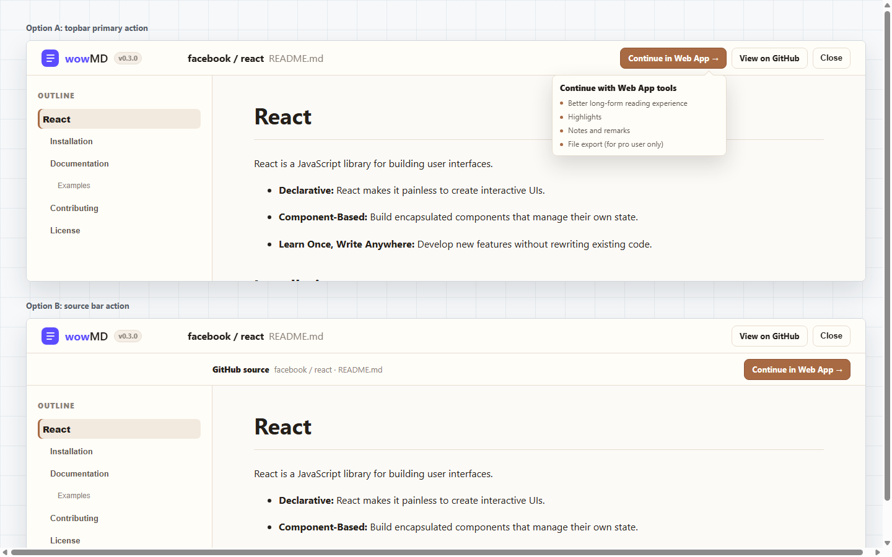

# wowMD v0.3 Full Reader Web App 入口 UI 方案

本文档只讨论插件的 Full Reader 界面，不在边栏提供 Web App 入口。

设计依据：

- 边栏保持轻量，只承担 GitHub 页面内快速阅读增强。
- Full Reader 代表更强阅读意图，适合承接 `Continue in Web App`。
- v0.3 只传递 GitHub `rawUrl` 和 source metadata。
- 不出现 Pro、Upgrade、Export、License、账号或支付文案。
- Full Reader 主要面向桌面阅读，移动端允许按钮换行或降级，不作为核心体验约束。

效果图：



## 方案 A：顶栏主操作

位置：

- 在 Full Reader 顶部右侧 actions 区加入 `Continue in Web App`。
- 与 `View on GitHub`、`Close` 并列。
- `Continue in Web App` 作为主按钮，使用当前阅读强调色。
- 鼠标停留或键盘 focus 时显示自定义 tooltip，说明 Web App 能提供的后续能力。

优点：

- 最符合现有 Full Reader 信息架构。
- 不增加额外垂直空间，阅读内容不下移。
- 用户进入 Full Reader 后，主操作立即可见。
- 与现有 `View on GitHub` 形成清晰关系：一个回源，一个继续到 Web App。
- 默认界面保持克制，只有用户对按钮产生兴趣时才解释价值。

风险：

- 顶栏操作数增加，需要控制按钮宽度。
- 较窄窗口下可允许按钮换行、隐藏次级按钮，或将 Close 收为图标。
- tooltip 文案不能暗示这些能力由插件提供，也不能变成付费拦截。

推荐 tooltip 文案：

```text
The Web App provides...

- Better reading experience
- Highlights and remarks
- Export to HTML (Pro users only)
- Full local access
```

交互要求：

- 使用自定义 tooltip，不使用浏览器原生 `title`，保证样式和品牌一致。
- hover 和 keyboard focus 都应触发，鼠标移出或 blur 后隐藏。
- tooltip 只说明 Web App 能力，不做 License 判断，不显示 Upgrade 文案。
- tooltip 不应遮挡按钮本身，也不应遮挡阅读正文的主要内容。
- 如果窗口空间不足，tooltip 可以右对齐、向下展开，必要时改为简短文案。

## 方案 B：来源条主操作

位置：

- 在 topbar 下方增加一条 source bar。
- 左侧展示 `GitHub source · owner/repo · path`。
- 右侧放置 `Continue in Web App`。

优点：

- 来源确认更清晰。
- 用户能明确知道将哪个文档传到 Web App。
- 对安全和信任感更友好。

风险：

- 增加一行垂直空间，正文整体下移。
- Full Reader 当前已经有 repo/path 信息，可能形成重复。
- 相比 v0.3 的窄功能目标略重。

## 推荐

推荐采用方案 A：顶栏主操作。

原因：

- 与当前 Full Reader 顶栏结构最一致。
- 不影响阅读区高度。
- 不给边栏增加额外入口，产品路径更清楚。
- 对 v0.3 来说足够克制，且开发改动最小。
- hover/focus tooltip 可以解释 Web App 的价值，同时不把 Pro 信息常驻在界面上。

推荐按钮文案：

```text
Continue in Web App →
```

中文环境：

```text
在 Web App 中继续 →
```

移动端处理：

- Full Reader 不以移动端为主要场景。
- 窄屏下按钮可以换行或截断。
- 如需优化，优先隐藏 `View on GitHub`，保留 Web App 主按钮和关闭按钮。
- 移动端没有 hover，不要求展示 tooltip；后续如需要，可以在长按、点击信息图标或首次点击前轻提示中处理。

## 额外建议

- `Continue in Web App` 点击后应直接打开 `/app/import`，不要先弹确认框。
- tooltip 中的 Pro 标注只放在具体 Pro 能力后面，例如 `File export (for pro user only)`，不要把整个 Web App 描述成 Pro。
- 建议保留 `View on GitHub`，因为它和 Web App 入口形成两个清晰方向：回源与继续阅读。
- 如果未来 Web App 的 Pro 能力还没上线，tooltip 文案应改成只列已上线能力，避免审核或用户预期风险。
