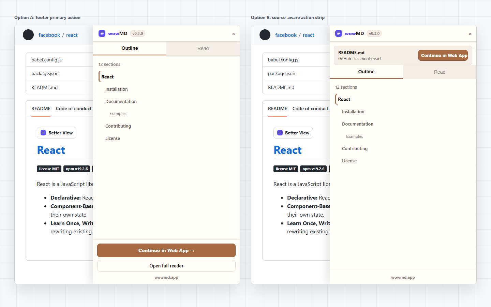

# wowMD v0.3 插件 UI 优化方案

本文档只讨论插件端 UI，不包含 Web App 页面设计。

设计依据：

- v0.3 只新增 `Continue in Web App` 入口。
- 插件不做 Pro、License、支付、高亮、附注、导出或 Health Check。
- UI 必须延续当前 wowMD 插件的暖色阅读面板、紫色品牌标记、棕色阅读强调色。
- 用户目标是继续阅读，不是被引导升级或理解新功能。

效果图：



## 方案 A：底部主操作型

位置：

- 在现有插件面板 footer 中新增 `Continue in Web App` 主按钮。
- 保留现有 `Open full reader` 作为次级动作。

优点：

- 对现有 UI 侵入最小。
- 不改变 Outline / Read 的阅读结构。
- 底部主操作符合当前面板操作区习惯。
- 用户读完或需要大屏继续阅读时，动作位置稳定。

人机工程：

- 主按钮全宽，命中区域大。
- 与现有 footer 操作分组一致。
- 不遮挡正文和目录。

风险：

- 用户需要视线移动到底部才能发现 Web App 入口。
- 如果未来 footer 操作增多，需要避免按钮堆叠。

## 方案 B：来源确认条型

位置：

- 在面板顶部、tabs 上方增加 source strip。
- 显示当前文档标题和 GitHub 来源。
- 在同一条内放置 `Continue in Web App` 按钮。

优点：

- 用户能立即确认即将传递的是哪个 GitHub 文档。
- Web App 入口更靠近文档上下文。
- 对跨页面跳转更有信任感。

人机工程：

- 操作位在面板上方，用户打开面板后更容易看到。
- source strip 同时承担确认和操作功能，减少认知跳转。
- 按钮保持单行，避免在窄面板中换行。

风险：

- 比方案 A 多占用垂直空间。
- 顶部信息密度更高，需要控制 title/repo 溢出。

## 推荐

优先推荐方案 A。

原因：

- v0.3 的目标非常窄，方案 A 最稳定、最少改动、审核风险最低。
- 当前插件已经有 footer 操作区，新增主按钮不会打断阅读。
- 它更符合“用户需要时继续到 Web App”的轻量入口定位。

如果希望用户更明确知道传递来源，可以在方案 A 的按钮上方增加一行极轻量来源文案，但不建议默认采用方案 B 的顶部 source strip，除非用户测试显示入口发现率不足。

建议最终文案：

```text
Continue in Web App →
```

中文环境：

```text
在 Web App 中继续 →
```
